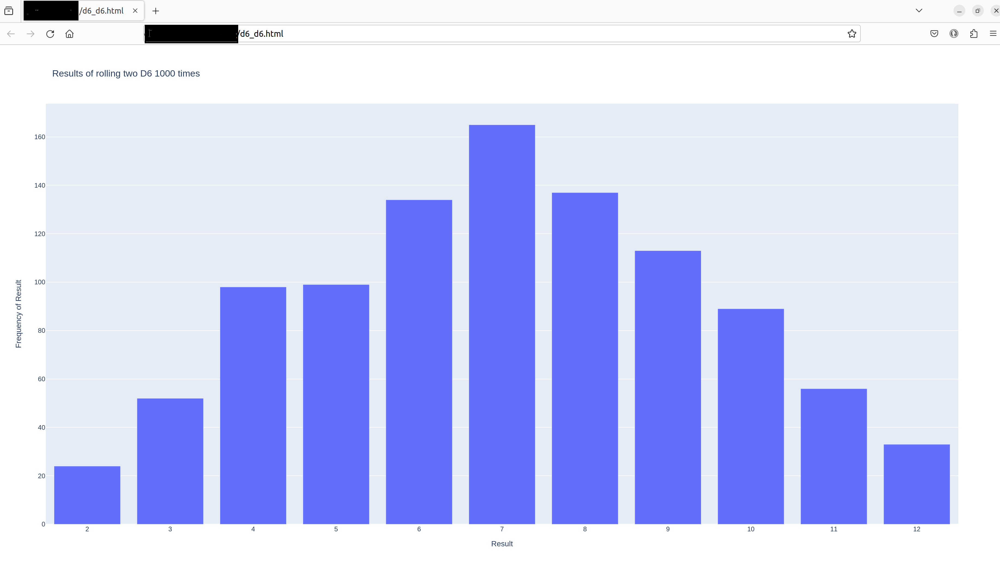
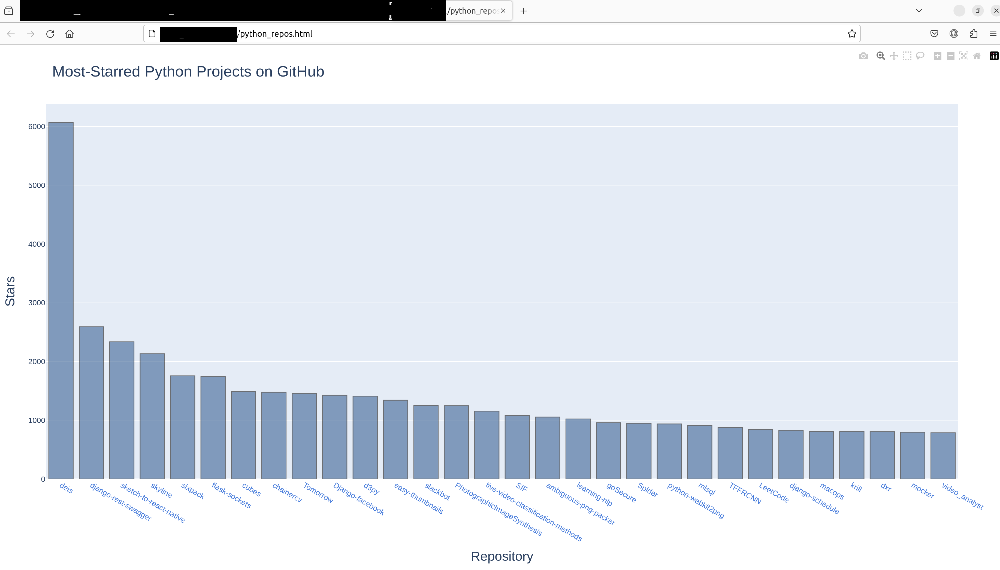

# Python_Data_Visualization
This is my attempt at Python Data Visualisation Exercises. 

### Rolling Dice with Plotly
Using Plotly to visualize the results of rolling a dice

 
  

### Visualizing Repositories Using Plotly
Using GitHub API to customize the chart's apperance with Plotly. 

 
  

## Getting Started
### Prerequisities
To use Matplotlib and Plotly for your initial set of visualizations, you’ll need to install it using pip, a module that downloads and installs Python packages.
